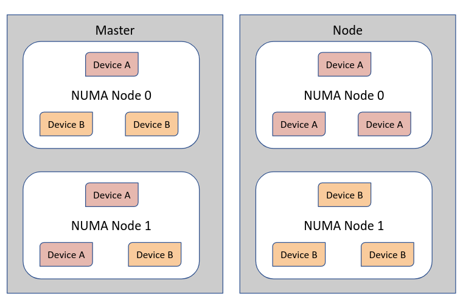

# Sample Device Plugin

This is a sample device plugin repository to enable support for sample devices in a kubernetes cluster using the device plugin API.
The motivation for this was to emulated devices on a NUMA node basis in a kubernetes environment in case the environment does not have multi numa hardware or for testing purpose.
This repo contains a device plugin to be deployed on a multi-node cluster (at least one master and one worker node).
The devices emulated on various NUMA nodes on a two node cluster is explained in the diagram below:



## Installation

1. Use the following environment variables for any of the `make` invocations documented below:
   - `RUNTIME`: select container runtime to use, podman or docker. Default is podman.
   - `REPOOWNER`: owner of the repo (on `quay.io`) on which upload the images. *You need to change this!*
   - `IMAGENAME`: name of the container image to be uploaded. Default is `device-plugin`.
   - `IMAGETAG`: tag of to use for the container image. Default is `latest`.
2. To deploy the device plugin run:
```bash
REPOOWNER=myorg make push
REPOOWNER=myorg make deploy
```

The Makefile provides other targets:
* build: Build the device plugin go code
* gofmt: To format the code
* push: To push the docker image to a registry
* images: To build the docker image

NOTE: The Makefile also contains individual device plugin specific targets in case they need to deployed independently

## Workload requesting devices

To test the working of the device plugins, deploy test deployment that requests both devices
```python
make test-both
```
In case topology manager has been enabled with a single-numa-node policy, for a workload requesting an instance each of both devices (as in manifests/test-both-success.yaml) the devices would have to be allocated from the same NUMA node which would be only possible if the workload gets placed on the master. The nodeselector to force the pod to run on the master is to ensure that the pod is deployed successfully as the scheduler lacks topology information.
manifests/test-both-taerror.yaml showcases a scenario where Topology affinity error is caused due to failure to align resources on the same NUMA node
